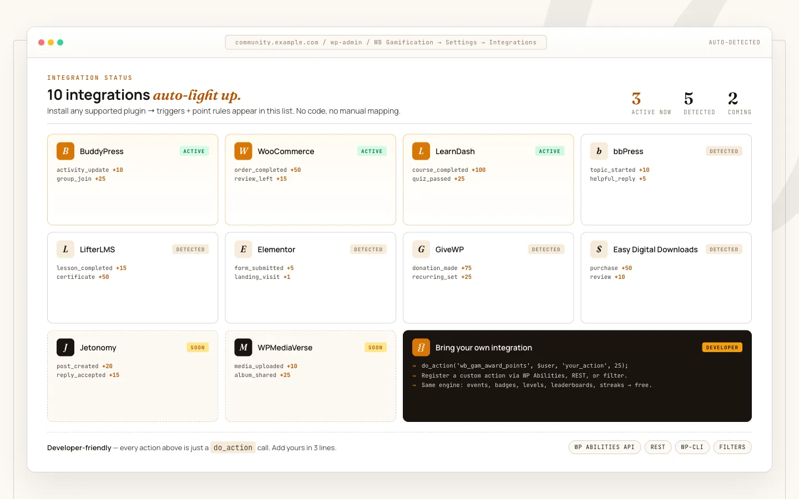

# Integrations Overview

WB Gamification connects to other WordPress plugins automatically. You do not configure integrations manually - the `ManifestLoader` scans for manifest files at `plugins_loaded` priority 5 and registers their actions before the engine boots.

## How Auto-Discovery Works

Each integration is a PHP file that returns an array of trigger definitions. When the target plugin is active, the manifest loads and its actions become available in the points engine, badge rules, and challenge conditions. If the target plugin is not active, the manifest returns an empty array and is skipped entirely.

**First-party manifests** ship inside the `integrations/` directory of WB Gamification itself. **Drop-in manifests** ship inside the target plugin: any plugin can place a file named `wb-gamification.php` in its own folder, and `ManifestLoader` discovers it automatically when that plugin is active.

## Supported Integrations

| Plugin | Actions | Manifest Location |
|---|---|---|
| WordPress Core | 8 | `integrations/wordpress.php` |
| BuddyPress | 14 | `integrations/buddypress.php` |
| bbPress | 3 | `integrations/bbpress.php` |
| WooCommerce | 5 | `integrations/woocommerce.php` |
| LearnDash | 5 | `integrations/learndash.php` |
| LifterLMS | 5 | `integrations/contrib/lifterlms.php` |
| MemberPress | 3 | `integrations/contrib/memberpress.php` |
| GiveWP | 4 | `integrations/contrib/givewp.php` |
| The Events Calendar | 3 | `integrations/contrib/the-events-calendar.php` |
| Jetonomy | 4 | `integrations/jetonomy.php` |
| Jetonomy Pro | 7 | `integrations/jetonomy-pro.php` |
| WPMediaVerse | 15 | `integrations/wpmediaverse.php` |

First-party manifests also ship for other Wbcom products - BuddyNext, Learnomy, Eventonomy, WB Listora, and WP Career Board - and load automatically when that product (and, where applicable, its Pro edition) is active.

In addition to the manifest actions above, Jetonomy reputation deltas are mirrored 1:1 into the points ledger (see [Jetonomy integration](150-jetonomy.md)), and WB Gamification defers its own leaderboard display to Jetonomy's reputation ranking when Jetonomy is active.

## Zero Configuration

Once an integrated plugin is active, its actions appear immediately in:

- The points engine (with default point values you can override)
- Badge award conditions
- Challenge target conditions
- The Actions admin screen (**WB Gamification → Actions**)

Default point values are set per action in each manifest. You can override any default from **WB Gamification → Actions → Edit**.

## Checking Integration Status

Run `wp wb-gamification doctor --verbose` to see which integrations are detected, how many actions are registered per integration, and whether any duplicate hook registrations exist.
