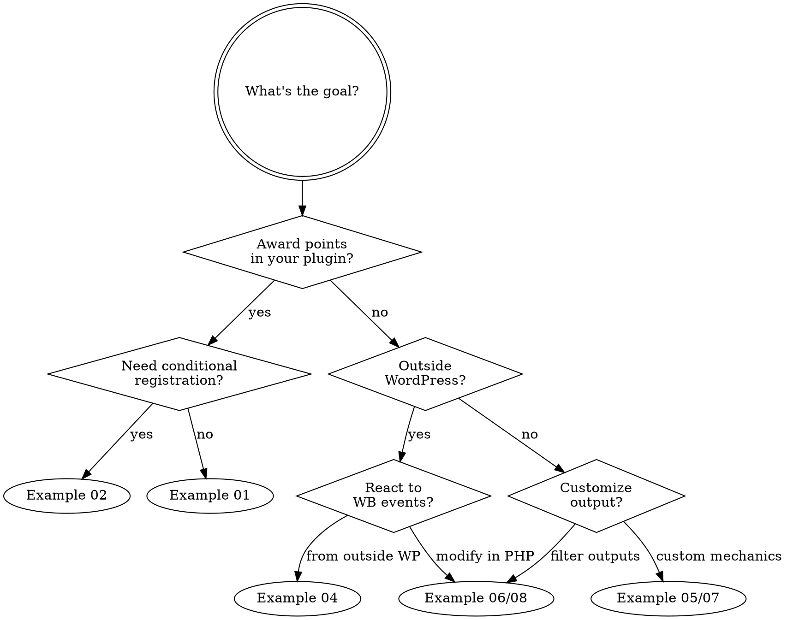

# Integration Examples

Concrete, copy-paste-ready integrations for third-party plugins, themes, and external services. Each sample is a complete, working unit — no placeholders, no `// TODO` lines.

> **Companion**: [`/plans/INTEGRATION-GAPS-ROADMAP.md`](../plans/INTEGRATION-GAPS-ROADMAP.md) tracks what's NOT yet integratable.

## Pick the example that matches your need

| You want to... | Open this folder |
|---|---|
| Award points when something happens in your plugin | [`01-track-event-via-manifest/`](01-track-event-via-manifest/) |
| Register an event at runtime (themes, mu-plugins, conditional registration) | [`02-programmatic-register/`](02-programmatic-register/) |
| Fire gamification events from a mobile app, headless frontend, or third-party service | [`03-rest-events-from-mobile/`](03-rest-events-from-mobile/) |
| Receive notifications when something happens in WB Gamification (Zapier / Slack / custom server) | [`04-listen-via-webhook/`](04-listen-via-webhook/) |
| Define a badge that's awarded based on a custom condition (not just point thresholds) | [`05-custom-badge-condition/`](05-custom-badge-condition/) |
| Tier-based or context-aware point multipliers ("VIPs earn 2× points") | [`06-modify-points-per-action/`](06-modify-points-per-action/) |
| Define a brand-new challenge mechanic (not just "do X N times") | [`07-custom-challenge-type/`](07-custom-challenge-type/) |
| Add a column / annotation to the leaderboard | [`08-leaderboard-customization/`](08-leaderboard-customization/) |
| Replace the default weekly recap email with a branded variant | [`09-override-email-template/`](09-override-email-template/) |
| Inject UI before/after any block render | [`10-inject-into-block-render/`](10-inject-into-block-render/) |

## Quick decision guide

## Cross-cutting concerns

### Auth (for REST examples)

Three modes work, in order of recommended use:

1. **Cookie + `wp_rest` nonce** — best for in-WP frontend code (the WB Gamification blocks already use this).
2. **Application Passwords** — best for first-party server-to-server integrations on the same WP install.
3. **Plugin-issued API key** (`X-WB-Gam-Key` header) — best for external systems (mobile apps, third-party services). Issue keys via Settings → API Keys.

### Capabilities

`manage_options` always works. To delegate without admin, grant a granular cap:

- `wb_gam_award_manual` — manual point award/revoke
- `wb_gam_manage_badges` — badges + rules + manual badge award
- `wb_gam_manage_challenges` — challenges + community challenges + cohorts
- `wb_gam_manage_rewards` — redemption store catalog
- `wb_gam_manage_webhooks` — webhook config
- `wb_gam_view_analytics` — analytics dashboard

Use `\WBGam\Engine\Capabilities::user_can( 'wb_gam_manage_badges' )` in your own code if you want the same admin-or-granted-cap gate.

### Versioning

All examples target **WB Gamification v1.0.0+** and **WordPress 6.4+** / PHP 8.1+. Each example's PHP file declares a guard so the example is safe to copy verbatim into a host plugin even if WB Gamification is not installed.

## Where to find the API surface

- **Hooks reference** — [`docs/website/developer-guide/hooks-filters.md`](../docs/website/developer-guide/hooks-filters.md)
- **Manifest schema** — [`docs/website/developer-guide/manifest-files.md`](../docs/website/developer-guide/manifest-files.md)
- **REST API** — `GET http://your-site/wp-json/wb-gamification/v1/openapi.json` (or [`docs/website/developer-guide/rest-api.md`](../docs/website/developer-guide/rest-api.md))
- **WP-CLI** — `wp wb-gamification --help`
- **Inventory** — [`audit/manifest.json`](../audit/manifest.json) lists every endpoint, hook, table, block, and capability with file:line citations.

## Contributing a new example

1. Copy an existing sub-folder as a template.
2. Match the structure: one PHP file (or `.md` for non-PHP integrations), inline header comment with the use case, and a short README describing what it demonstrates.
3. Test it against a real `wb-gamification.local` install before submitting.
4. Add the example to the table at the top of this README.

## License

Same license as the host plugin (GPL-2.0+). Treat these as starter code — copy, modify, ship.
